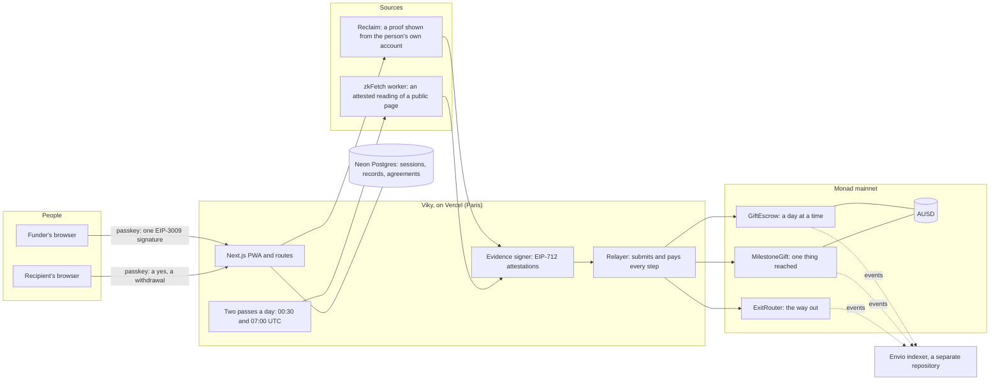

# Viky

The money is already in their name. Every day they miss, a piece comes back to you.

Viky is a conditional payment on Monad. Someone puts money behind another person's goal. The money is
allocated in the recipient's name from day one, becomes theirs as verified progress accrues, and
returns to the funder for whatever is not accomplished. Nobody ever profits from a missed day.

Live app: [viky.cash](https://viky.cash). Built for Monad Metropolis, track Consumer Products & Payments.

## Who it is for, and the problem

Viky is for the person who pays for somebody else's effort from a distance and cannot check it themselves: a
parent paying for a year of studies in another city or another country, a relative backing a language, a
certificate, a race. Today they send the money and hope, or they hold it back and ask for proof in a message.
Either way the money and the proof travel apart, and the one who pays is the one who has to ask.

With Viky the money is put in the other person's name on the first day. A source that is not Viky says whether
the thing was done: the lesson, the rating, the certificate, the enrolment. Each verified part becomes theirs,
and whatever is not earned comes back to the funder by itself. Nobody profits from a missed day: not Viky, not a
pool, not another user.

Tools for keeping a commitment already exist (Beeminder, StickK, Forfeit): there, a person stakes their own
money and loses it to somebody else. What Viky does differently is the third-party funder, the money allocated in
the recipient's name, the release on a verified reading, and the automatic return of the rest.

Two things Viky does not claim: that a habit lasts once the money stops, and that a transfer through Viky costs
less than a bank's.

## For judges

[viky.cash/judges](https://viky.cash/judges) is the one page for verifying Viky: the contract addresses on Monad
mainnet, who owns them (read from the chain when the page is served), every condition a gift can wait for and the
source it is read from, the commands to re-verify a credited day yourself, and the risks and limits, written as they
are. It also says how to try the product with your own passkey.

## How Viky was built

### AI tools

Viky was built with an AI coding tool, Claude Code (Anthropic). It wrote most of the code, the tests and the
documentation in this repository from the author's written briefs, and it ran the checks before each merge: types,
lint, the policy tests, the build and the browser tests. The author directed all of it: what the product is, how it
looks, what every screen says, and every decision that touches money. Nothing was deployed to mainnet and no real
payment was made without his explicit decision. Two people from outside the project have each opened a gift, one
of them on an iPhone, from Instagram.

### Pre-existing code

Two things in this repository were not written for this hackathon.

**Code ported from Lock-in.** Lock-in is an earlier project by the same author, in a private repository. It verified
a daily Duolingo lesson and a Strava run with Reclaim proofs. Viky is another product: a third party funds, and nothing
is staked. What it took from Lock-in is the verification plumbing, ported file by file on 10 Sep 2026 (commit
`67656ba`) and edited since:

- the account session and the guards every route starts with: `src/account-auth-server.ts`, `src/api-guard.ts`,
  `src/rate-limit.ts`, `src/monad-gas.ts`;
- the Reclaim proof handling: `src/reclaim-abi.ts`, `src/reclaim-types.ts`, `src/reclaim-channel.ts`,
  `src/reclaim-onchain.ts`, `src/reclaim-proof-set.ts`, `src/proof-session-store.ts`;
- the Duolingo proof: `src/duolingo-profile.ts`, `src/duolingo-proof-policy.ts`, `src/duolingo-verification.ts`,
  `src/gift-attestation.ts`, `scripts/capture-duolingo-proof.ts`, `scripts/transform-duolingo-proof.ts`;
- the two routes of a proof shown from the person's own account, `app/api/proof/session/route.ts` and
  `app/api/proof/verify/route.ts`, which were Lock-in's Duolingo session and verify routes and now serve every
  shown condition;
- the on-chain verifiers, which are not deployed (see Contracts): `contracts/verifiers/VikyProofTypes.sol`,
  `contracts/verifiers/VikyReclaimVerifier.sol`, `contracts/verifiers/VikyStravaReclaimVerifier.sol`;
- `scripts/check-contract-sizes.ts`, which came in the same commit;
- their tests: `test/VikyDuolingoRealProof.t.sol`, `test/VikyReclaimVerifier.t.sol`,
  `test/VikyStravaRealProof.t.sol`, `test/VikyStravaReclaimVerifier.t.sol`, `test/account-auth.test.ts`,
  `test/api-guard.test.ts`, `test/duolingo-profile.test.ts`, `test/duolingo-proof-policy.test.ts`,
  `test/duolingo-verification.test.ts`, `test/gift-attestation.test.ts`, `test/monad-gas.test.ts`,
  `test/proof-session-store.test.ts`, `test/rate-limit.test.ts`, `test/reclaim-channel.test.ts`,
  `test/reclaim-proof-set.test.ts`.

That is 37 files and about 7,200 of the 109,700 lines of code and tests in `app`, `src`, `contracts`, `scripts` and
`test`, as they stood on 1 Oct 2026. `contracts/GiftEscrow.sol` is new, and the guards it applies to an attestation
(freshness, clock skew, nullifiers, identity binding, pauses) follow the ones of Lock-in's escrow. `src/shown-proof.ts`
generalises the one-source flow that was ported.

**The template.** The app started from the PWA template Monad publishes for developers,
`monad-developers/next-serwist-privy-embedded-wallet` (Next.js with Serwist: the service worker, the offline page,
the install prompt, web push), taken from its `main` branch. Privy was removed by hand and replaced with Mera
passkeys, and the template was moved from Next 14 to Next 16 and from Serwist's webpack plugin to its Turbopack
integration.

Everything else was written between 10 Sep 2026 and the submission.

## Why Monad

Only what was measured, or what Monad's own documentation states.

- **Nobody but Viky pays a fee, and it is small enough to be Viky's.** Every step of a gift is submitted and paid for
  by one relayer, so neither person ever holds MON or reads a fee. Read from the chain on 1 Oct 2026 at 08:22 UTC
  with `pnpm relayer:fees`: 111 transactions sent since the first one, 2.070270 MON of fees in all, 0.0187 MON a
  transaction on average. A credited day costs 0.017544 MON (transaction
  `0x5aa6752fc8c7db2526a5e5bafe6aeb91e09bd1cbe0cf3d4a6bc5e8f65f664ffd`: a limit of 172,000 at 102 gwei).
- **A person waits about a second.** A block every 302 ms, measured over the last million blocks on 1 Oct 2026, and a
  block is final after two ([docs](https://docs.monad.xyz/developer-essentials/summary)). Nothing is shown as done
  before the block that holds it is at or below the `finalized` tag (`waitForFinality`, `src/monad/chain.ts`).
- **One signature funds a gift.** AUSD is on Monad with EIP-3009: the funder signs once, and that signature is both
  the payment and the acceptance of the gift's exact terms, because the authorization's nonce is the hash of the terms.
  The relayer submits it; `receiveWithAuthorization` can only land in the contract.
- **Monad's own rules, followed.** The fee is the declared limit times the price, not the gas used
  ([docs](https://docs.monad.xyz/developer-essentials/gas-pricing)), so every relayed step is estimated and given a
  margin of 7.5 % and no more (`src/monad-gas.ts`). The chain reserves 10 MON per account
  ([docs](https://docs.monad.xyz/developer-essentials/reserve-balance)), so the relayer refuses to send below 12 MON
  (`src/relayer.ts`).

## Architecture



A person's passkey derives their account in the browser; no key ever reaches a server. The funder's one signature
funds a gift. From then on Viky reads the source, the evidence signer attests what was read, the relayer submits it,
and the contract moves the money: to the recipient for what is verified, back to the funder for what is not.

## Stack

- PWA: Next.js 16 with Serwist (offline fallback, web push), Turbopack build.
- Accounts: Mera passkeys only. A passkey's PRF output derives an ordinary Monad account
  (BIP-44 `m/44'/60'/0'/0/0`). No seed phrase, no extension, no custody backend.
- One passkey, two keys. The same ceremony that signs a person in evaluates a second salt,
  `sha256("viky:consent:v1")`, and its output is an Ed25519 key held in the browser's memory
  (`src/client/consent-key.ts`). It signs the recipient's yes and their stop, and nothing else: it is not the account's
  key and can move no money, so the agreement to be read is given with the least privilege it needs. The server keeps
  the text that was signed, the signature and the key's public half, with the gift, and checks them again at every
  reading that could move money (`src/consent-guard.ts`): no yes, or a stop, and nothing is read.
- Asset: AUSD on Monad mainnet.
- Contracts: Foundry 1.8.1 with `network = "monad"`.
- Tests: `node:test` through `tsx` for TypeScript, `forge test --network monad` for Solidity, Playwright for the
  screens.

## Contracts

Three contracts hold or move money, and none can be upgraded. On the two that hold gifts, no function of the owner
moves a gift's money: the owner registers a goal, replaces the evidence signer, or pauses.

`contracts/GiftEscrow.sol` holds a gift for a habit, a day at a time: creation and funding in one transaction through
the funder's EIP-3009 authorization, the claim by the recipient's account, daily check-ins attested by the evidence
signer, the draining of a missed day once its catch-up window of 30 hours has passed, the withdrawal of what is earned
and the refund of what is not. A gift nobody opens within 14 days goes back whole.

`contracts/MilestoneGift.sol` holds a gift for one thing, with a deadline: all of it becomes the recipient's the first
time an attested reading shows it reached, or all of it goes back. It has two shapes. A climb, for something measured
that moves (a rating): the first reading is recorded as the start, and the gift pays only if that start was at or below
the highest the funder accepted. Something had or not, for something granted once with a date (a certificate, an
enrolment, a race): it pays when the day it was granted falls between the funding and the deadline, and what was
granted in time may still be shown for 14 days after.

`contracts/ExitRouter.sol` is the way out: it turns what a gift earned into the coin a payout service takes, through
an exchange its owner has allowed, in one transaction the relayer submits. One signature says everything, because its
nonce is the hash of the terms. The exchanged coin goes to the person, never to a payout service. The contract holds
nothing between two transactions; its owner allows or removes an exchange, and can return what an exchange might leave
behind (`sweep`).

| Contract | On Monad mainnet (chain 143) |
|---|---|
| `GiftEscrow` | `0x995Ab09d8B20511d057E9E87D00fa1f41fC0e233` |
| `GiftEscrow`, the earlier deployment, which still runs the gifts it holds | `0xE04CD59bB93765333200a9da01df83149D4C4d67` |
| `MilestoneGift` | `0x8dc281Ac8a1c789fdb65a063b9225E98eC522F0e` |
| `ExitRouter` | `0x8a1790DfD10CF1599bDaeD5eC8BB46B2A6eB6223` |
| Owner of the four, a Safe 1.4.1 that signs with 2 of its 3 keys | `0xE08D926c148A5065F4Df2892702785a183de86F9` |
| AUSD | `0x00000000eFE302BEAA2b3e6e1b18d08D69a9012a` |

`cast call <contract> "owner()(address)" --rpc-url https://rpc.monad.xyz` answers the Safe for each of the four.

`contracts/verifiers` is not deployed. It holds the direct verifiers ported from Lock-in with their real-proof tests,
kept fail-closed (`LIVE_SCHEMA_CONFIRMED = false`). The path in production is the evidence signer, below.

`contracts/GiftEscrowV2.sol`, `contracts/MilestoneGiftV2.sol` and `contracts/ConsentAnchor.sol` are written and
tested, and **not deployed: no gift runs on them**. They are the second version of the two gift contracts, from the
audit of 1 Oct 2026. Opening a gift takes the signature of a key made from the secret its link carries, whose address
is in the terms the funder signed, so the evidence signer opens nothing (on the contracts above, that one key could
open an unopened gift and prove it). The person a gift is for can end it: what was counted stays theirs and the rest
goes back in the same transaction. The owner is bounded: ownership moves in two steps and cannot be given up, a new
evidence signer stands a day after it is announced, a goal is added and never changed, and a pause ends by itself
after seven days and holds the open days rather than taking them. `ConsentAnchor` holds no money: it records which
consent key an account agrees with, bound by the account's own signature, and every yes and stop in order.

The server side of the anchor is written too, and off until the anchor's address is set: the browser signs the short
anchored message with the consent key it already holds, in the same gesture as the agreement, and the relayer writes
it (`src/consent-anchoring.ts`). `pnpm verify:consent` then holds every reading that moved money on the second
version against a yes anchored before it, checking each Ed25519 signature itself; it needs a Monad RPC and nothing
else. Both have run on a local fork of mainnet (`pnpm rehearse:v2`) and never on mainnet.

`forge test --network monad` runs the unit suites, the accounting fuzz, the invariant campaigns of the second version
and the typehash parity pins; with `MONAD_RPC_URL` set it also runs the mainnet fork tests against the real AUSD. `pnpm deploy:gift-escrow` deploys
and `pnpm check:gift-escrow` verifies a deployment against the expected configuration.

## Verification path

Three kinds of proof reach the evidence signer, and they are not checked the same way. What is true in production
today (`PROOF_VERIFIER` unset):

1. **A proof the person shows from their own account, with a TEE attestation** (a Reclaim session: `app/api/proof/session`,
   `app/api/proof/verify`). It is verified server side with js-sdk `verifyProof` and the application secret: the
   attestor's signature and the attestation of the TEE it ran in, both required. A proof without a TEE attestation
   (the AI fallback) is refused before anything else is read.
2. **A proof the person shows through a witness provider, with no TEE** (a university's own portal, read by a
   provider made for that portal). There is no TEE to require, so the proof is verified by the pinned witness's
   signature on the portal's own domain (`src/shown-verification.ts`). The first proof from a portal is held, nothing
   is relayed, and an operator reads what the pattern read before pinning it (`pnpm portal:pin`); once pinned, a proof
   must match the pin exactly.
3. **A reading Viky makes itself** (zkFetch: the daily Duolingo lesson, the Chess.com ratings, the certificates, a race,
   and a connected source's reading with the person's key). It is fetched through Reclaim's TEE client and verified
   server side by the attestor's signature only: js-sdk `verifyProof` checks it against the attestor list it fetches
   from Reclaim at that moment, then Viky's own pin (`RECLAIM_ATTESTOR_ADDRESSES`). The proof carries no attestation of
   the attestor's TEE, so the TEE itself is not verified on this path.

**Behind the switch** (`PROOF_VERIFIER=local`, not set in production): a reading is verified offline, by Viky alone,
the way `pnpm verify:day` does it by hand: the claim's identifier recomputed, the signers recovered, every signer one
of Viky's pinned attestors, and the witnesses exactly those signers; with `RECLAIM_ATTESTOR_IMAGE_DIGESTS` set, every
witness must also carry the attestation of the TEE holding its key, verified offline and pinned by image digest
(`src/proof-verification.ts`).

Either way, what is accepted is then attested to the contract by the evidence signer (EIP-712 `CheckIn`, or the
milestone contract's `Proof`), and no reading that could move money is taken without the recipient's signed yes (a
gift funded before 30 Sep 2026, when agreements began, is read as before until its recipient answers). Session rows
are held server side; the browser never chooses the account, the phase, the day or the profile.

## Check a credited day yourself

Anybody can check that a day Viky credited really had a proof behind it. It needs no key, no account, no environment
variable and no permission from us:

```bash
git clone https://github.com/RedGnad/Viky.git
cd Viky
pnpm install
pnpm verify:day
```

It takes the one example published with its account holder's agreement (`/api/judges/example` on viky.cash),
recomputes the claim's identifier from the signed claim, recovers the attestor that signed it, recomputes the
fingerprint, asks the gift contract whether that fingerprint is recorded against replay, and reads the transaction
back to see it credit that day. Every answer is printed beside what it was compared against.

The two people a gift is between can do the same with any day of their own: the gift's page hands over that day's
proof, then `pnpm verify:day --file day.json --gift <number> --day <day>`. A milestone gift settles on a reading, so
it takes `--reading <number>` instead.

**What it proves**: the source's own servers answered that, and the contract settled that day against that one claim,
which can never be replayed. **What it does not prove**: that the account belongs to the person the gift is for, or
that a human rather than a script did the work. The account is tied to the person once, separately, by a code in its
display name or by the funder naming it. The key that signs is ours and the owner can replace it, which is why this
check exists: a signed reading with no claim behind it cannot be re-verified by anybody.

## Indexer

The contracts' events are indexed with Envio HyperIndex in a separate repository,
[RedGnad/Viky-index](https://github.com/RedGnad/Viky-index): `config.yaml` names the four contracts above and the
events read from each, `schema.graphql` the entities (every gift, check-in, drained day, payout and refund, and the
aggregates per day, per condition and in all). It answers GraphQL at
`https://indexer.dev.hyperindex.xyz/8213f52/v1/graphql`. The product does not read it: no movement of money depends on
it, and every figure the app shows comes from the contracts themselves.

## Run

```bash
pnpm install
pnpm dev
```

Passkeys need HTTPS or `localhost`. The relying party id is the hostname the app is served from,
so accounts created on a preview hostname stay on that hostname.

## Environment

[`.env.example`](.env.example) lists every variable, with no value, in the order they are needed. Copy it to
`.env.local`, which is never committed.

- **With no variable at all**: `pnpm verify:day`, `pnpm relayer:fees` and `pnpm test:policy`.
- **To start**: a session secret and a database. Accounts and the screens work; nothing moves money.
- **For the money**: the relayer, the evidence signer and the contracts' addresses. Gifts are made, opened and settled
  on mainnet.
- **For the readings**: the Reclaim applications and the attested-fetch worker. A gift's condition is read and proved.

The functions run in Vercel's Paris region (`vercel.json`), next to the Frankfurt database, and two crons run the
passes: `/api/cron/daily` at 00:30 UTC and `/api/cron/settle` at 07:00 UTC. A third, `/api/cron/watch` at 02:00 UTC,
emails the operator when the morning pass is not in the journal. A fourth, `/api/cron/recount` at 03:30 UTC, reads
again the gifts whose reading failed on our side, before the day's catch-up window closes at 06:00 UTC, and runs the
whole reading pass when the morning one left nothing in the journal. `/api/health` answers 200 when the database, the
network, the reading worker, the relayer, the exchange's pin, the evidence key and the passes all hold, and 503 when
one does not; it needs no secret and answers nothing of any gift.

## Pages and routes

| page | what |
|---|---|
| `/` | the landing with the card a gift is prepared on; Home once signed in |
| `/fund` | paying for the gift prepared on the card, and its link |
| `/g/<id>?t=...` | a gift's own page, for the person it is for, its funder, or a reader of the link |
| `/gifts` | everything given and received |
| `/me` | the account: the currency, the appearance, what Viky reads, signing out (`/account` leads here) |
| `/cash-out` | "Spend or withdraw": a gift card, phone credit, or a transfer to a bank or a card |
| `/what-viky-can-check` | the catalogue: every condition and its state |
| `/add-your-university` | how a student adds their university's portal |
| `/help`, `/privacy`, `/legal` | five questions; what is kept and who processes it; who publishes and hosts the site |
| `/judges` | the only page with contract addresses |
| `/dev/*` | dev pages, answered only with `VIKY_DEV_PAGES=1` to an operator's account; a 404 in production |

Every route is a file under `app/api` (`find app/api -name "route.ts*"` lists them), grouped by what they serve:
`account` (the passkey session and preferences), `gift` and `gifts` (create, claim, connect, count, withdraw, consent,
the journal), `proof` (a proof shown from the person's own account), `connect` (a source connected with the person's
key), one folder per source read (`duolingo`, `chess`, `codeforces`, `coursera`, `edx`, `mitx-online`, `credly`,
`accredible`, `det`, `marathon`, `wca`, `portals`), `conditions` (what may be offered), `fund`, `exit`, `send`,
`phone` and `giftcards` (money in and out), `rails` and `rates` (which partner serves where, and the day's rate),
`cron` (the passes and the watch), `health`, `judge` and `judges`, and `dev`.

Operator commands: `pnpm keeper` (the same passes from a terminal), `pnpm zkfetch:worker [port]` (the attested-fetch
worker, deployed from `Dockerfile`), `pnpm portal:pin` (reviewing a first proof from a university), `pnpm pilot:report`
(the pilot gift by gift, read only), `pnpm relayer:fees`, `pnpm check:signer` (the evidence key of the environment
against the signer the contracts name, before a deployment), `pnpm check:sources` (every public source Viky reads,
asked whether it still answers in the shape the readers expect: a few plain GETs each, no secret, to run once a day
while gifts are read).

## Test

```bash
pnpm test:policy
pnpm test:solidity
pnpm test:browser
```

## Third-party licences

This repository is MIT. It depends on packages under other licences, used unmodified and not copied here:

- `@reclaimprotocol/zk-fetch` and `@reclaimprotocol/attestor-core` are under AGPL-3.0. The attested-fetch worker
  (`pnpm zkfetch:worker`) and a local reading call them.
- `snarkjs` and the packages it brings (`ffjavascript`, `r1csfile`, `fastfile`, `wasmcurves`, `wasmbuilder`,
  `@iden3/bigarray`, `@iden3/binfileutils`) are under GPL-3.0. They come with the Reclaim packages above.
- `@reclaimprotocol/js-sdk` and `@reclaimprotocol/zk-symmetric-crypto` name their licence in Reclaim's own repository.
- The fonts under `app/fonts` are under the SIL Open Font License 1.1 (`app/fonts/README.md`).

`pnpm licenses list --prod` prints the whole list.

## Security

See [SECURITY.md](SECURITY.md) to report a vulnerability.

## License

[MIT](LICENSE)
