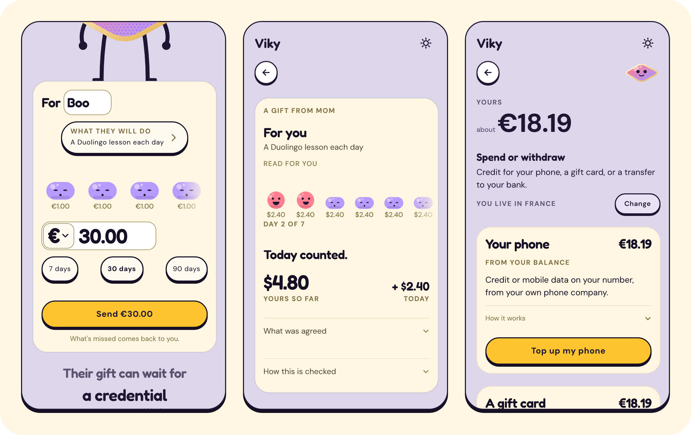
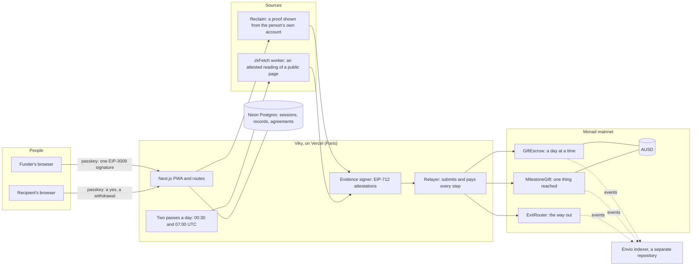

# Viky

**Send money that motivates.**

The money is already in their name. Every day they miss, a piece comes back to you.

Viky is a conditional payment on Monad. Someone puts money behind another person's goal. The money is
allocated in the recipient's name from day one, becomes theirs as verified progress accrues, and
returns to the funder for whatever is not accomplished. Nobody ever profits from a missed day.

**[The app](https://viky.cash)** · **3-minute video** (its link comes with the submission) · **[The judges page](https://viky.cash/judges)**

Built for Monad Metropolis, track Consumer Products & Payments.



Three of the app's own screens, photographed by the test suite with example data: the card a gift is filled in on, a
gift's page with its days, and "Spend or withdraw".

| On Monad mainnet (chain 143) | Where | Verified by |
|---|---|---|
| `GiftEscrowV3`: a gift for a habit, a day at a time | [`0x591d76863177E70FfcA2C793212d4715A367Ec70`](https://monadvision.com/address/0x591d76863177E70FfcA2C793212d4715A367Ec70) | its source, an [exact match](https://sourcify-api-monad.blockvision.org/v2/contract/143/0x591d76863177E70FfcA2C793212d4715A367Ec70) |
| `MilestoneGiftV2`: a gift for one thing reached, with a deadline | [`0x493c87A27E637bBc7179C17bE2B215fC18523CC0`](https://monadvision.com/address/0x493c87A27E637bBc7179C17bE2B215fC18523CC0) | its source, an [exact match](https://sourcify-api-monad.blockvision.org/v2/contract/143/0x493c87A27E637bBc7179C17bE2B215fC18523CC0) |
| `ExitRouter`: the way out of what a gift earned | [`0x8a1790DfD10CF1599bDaeD5eC8BB46B2A6eB6223`](https://monadvision.com/address/0x8a1790DfD10CF1599bDaeD5eC8BB46B2A6eB6223) | its source, an [exact match](https://sourcify-api-monad.blockvision.org/v2/contract/143/0x8a1790DfD10CF1599bDaeD5eC8BB46B2A6eB6223) |
| `ExitRouter`, a second copy set on USDC: the converter of card payments | [`0xf05449c8b868Ce1e6a0D7223e2ceCbbfD1498F9c`](https://monadvision.com/address/0xf05449c8b868Ce1e6a0D7223e2ceCbbfD1498F9c) | its source, an [exact match](https://sourcify-api-monad.blockvision.org/v2/contract/143/0xf05449c8b868Ce1e6a0D7223e2ceCbbfD1498F9c) |
| Their owner: a Safe 1.4.1 that signs with 2 of its 3 keys | [`0xE08D926c148A5065F4Df2892702785a183de86F9`](https://monadvision.com/address/0xE08D926c148A5065F4Df2892702785a183de86F9) | `owner()` on each contract |
| **A credited day, checked again from nothing** | `pnpm verify:day`, below | five answers, each `yes`, for transaction [`0x5aa6…4ffd`](https://monadvision.com/tx/0x5aa6752fc8c7db2526a5e5bafe6aeb91e09bd1cbe0cf3d4a6bc5e8f65f664ffd) |
| **A refusal**: an account that is not the recipient asks for what a gift earned | `cast call`, below | the error `NotRecipient()`, `0x586d3357` |

```bash
# A credited day: no key, no account, no variable.
git clone https://github.com/RedGnad/Viky.git && cd Viky && pnpm install && pnpm verify:day

# A refusal, on the contract in service, with Foundry's cast: it answers "execution reverted", data 0x586d3357,
# which is NotRecipient().
cast call 0x591d76863177E70FfcA2C793212d4715A367Ec70 "withdrawEarned(uint256,address,uint256)" \
  1000 0x000000000000000000000000000000000000dEaD 1 --rpc-url https://rpc.monad.xyz
```

`pnpm verify:day` proves that the source's own servers answered and that the contract settled that day against that
one claim, which can never be used again. It does not prove whose account it is, nor that a human did the work:
[what it checks, and its limits](docs/VERIFICATION.md#check-a-credited-day-yourself). The sources are verified on
MonadVision, the explorer, through its Sourcify instance. The nine deployments, the earlier versions that still run
the gifts they hold among them, are in [Contracts](docs/CONTRACTS.md).

[](https://github.com/RedGnad/Viky/actions/workflows/ci.yml?query=branch%3Amain)
the last run of the checks on `main`: types, lint, the policy tests, the contracts' tests and the screens in a browser.

## Who it is for, and the problem

Viky is for the person who pays for somebody else's effort from a distance and cannot check it themselves: a
parent paying for a year of studies in another city or another country, a relative backing a language, a
certificate, a race. Today they send the money and hope, or they hold it back and ask for proof in a message.
Either way the money and the proof travel apart, and the one who pays is the one who has to ask.

With Viky the money is put in the other person's name on the first day. A source that is not Viky says whether
the thing was done: the lesson, the rating, the certificate, the enrolment. Each verified part becomes theirs,
and whatever is not earned comes back to the funder by itself. Nobody profits from a missed day: not Viky, not a
pool, not another user.

## What we know about the two people

**The one who pays** is an adult paying for another adult's studies or training from a distance. One measure of how
common that is: France alone hosted 17,722 students from Senegal and 12,672 from Côte d'Ivoire in 2024-2025
([Campus France](https://ressources.campusfrance.org/publications/mobilite_pays/fr/senegal_fr.pdf),
[Campus France](https://ressources.campusfrance.org/publications/mobilite_pays/fr/cote_ivoire_fr.pdf)). That is an
example, not a limit: Viky is a worldwide pilot, and both people confirm they are 18 or older.

[What the funders we spoke to said, in their words.]

**The one who is read** asked for nothing: somebody else decided their progress would be checked. The research on
money tied to effort, and on being watched, points the same way. Each line is why a screen of Viky is the way it is.

| What is known | What Viky does with it |
|---|---|
| The same money works better given first and taken back than paid as a reward. In a randomised trial of 281 adult employees over 13 weeks, people met their daily goal on 45 % of days when $42 was allocated up front each month and $1.40 removed for each missed day, against 35 % when $1.40 was paid for each day met, and 30 % with no money. Only the first group beat the control ([Patel et al., Annals of Internal Medicine, 2016](https://pubmed.ncbi.nlm.nih.gov/26881417/)). | The whole amount is in the recipient's name from the first minute, and a missed day takes its share away. |
| In the same trial, the effect stopped when the money stopped. | Viky does not claim that a habit lasts after a gift ends. |
| People who are watched resent it. Of 736 reviews that children and teenagers wrote of parental-control apps, 76 % gave one star ([Ghosh et al., CHI 2018](https://www.cs.ucf.edu/~jjl/pubs/pn1838-ghoshA.pdf)). College students rated online monitoring as more invasive than helpful ([Smetana and Li, Journal of Adolescence, 2026](https://doi.org/10.1002/jad.70253)). Over three years, privacy invasion left parents knowing less, because it bred secrecy ([Hawk et al., Developmental Psychology, 2013](https://pubmed.ncbi.nlm.nih.gov/22889388/)). | The funder sees yes or no for a day and, for a goal with a number (a rating, a score, a grade, a time), that number and whether it reaches the target. Nothing else that was read: no route, no time of day, no step count. |
| Yet telling the one who pays does help: sending parents information on progress raised achievement ([Bergman, Journal of Political Economy, 2021](https://doi.org/10.1086/711410)). | The funder is told in one sentence, on their phone if they ask for it: the day counted, the day came back, the goal is reached. |
| Making participation public lowers it: among students in non-honours classes, sign-up for a course was 11 points lower when the choice was public ([Bursztyn and Jensen, Quarterly Journal of Economics, 2015](https://www.nber.org/papers/w20714)). | No feed and no profile. On a gift's page, the names and the account read are shown only to its two people and to whoever holds its link, and the page is kept out of search engines. |
| What makes people share an account is control. Among 3,539 US adults, consent, deletion, oversight and transparency together weighed 51.5 % of the decision to share ([Gupta et al., JAMA Network Open, 2023](https://pubmed.ncbi.nlm.nih.gov/36862410/)). In a survey of 5,470 Canadian adults, 63 % said they would be more likely to share if they could stop at any time ([Financial Consumer Agency of Canada, 2023](https://www.canada.ca/en/financial-consumer-agency/programs/research/open-banking-consumer-protection.html)). | The recipient agrees with a signature of their own before any reading that can move money, can stop being read, and can end the gift and keep what they earned. |

These studies have their limits: the trial ran at one employer and counted steps, and the reviews are self-selected.
They are why the design is what it is, not proof that Viky works.

**What using it with people showed us.** [N] people outside the team have opened a gift and [N] have funded one;
the judges page counts them by account, from the index. Four things changed because of what happened:

- A link opened inside Instagram could not create an account. The page now has a button that opens it in the phone's
  own browser: shipped within two hours, on 1 Oct 2026.
- The app spoke in dollars to someone in France. It now starts in the currency of the country the reader connects
  from: fixed the same day.
- "Use your money" was read as "make a gift with it". The button became "Spend or withdraw".
- A lesson done right after connecting only counted the next day. A third contract, deployed on 3 Oct 2026, pays a
  day the day it is done.

## What is new

Tools for keeping a commitment already exist (Beeminder, StickK, Forfeit): there, a person stakes their own
money and loses it to somebody else. What Viky does differently is the third-party funder, the money allocated in
the recipient's name, the release on a verified reading, and the automatic return of the rest.

Two things Viky does not claim: that a habit lasts once the money stops, and that a transfer through Viky costs
less than a bank's.

## Why Monad

Only what was measured, or what Monad's own documentation states.

- **Nobody but Viky pays a fee, and it is small enough to be Viky's.** Every step of a gift is submitted and paid for
  by one relayer, so neither person ever holds MON or reads a fee. Read from the chain on 1 Oct 2026 at 08:22 UTC
  with `pnpm relayer:fees`: 111 transactions sent since the first one, 2.070270 MON of fees in all, 0.0187 MON a
  transaction on average. A credited day costs 0.017544 MON (transaction
  `0x5aa6752fc8c7db2526a5e5bafe6aeb91e09bd1cbe0cf3d4a6bc5e8f65f664ffd`: a limit of 172,000 at 102 gwei).
- **A person waits about a second.** A block every 302 ms, measured over the last million blocks on 1 Oct 2026, and a
  block is final after two ([docs](https://docs.monad.xyz/developer-essentials/summary)). Nothing is shown as done
  before the block that holds it is at or below the `finalized` tag (`waitForFinality`, `src/monad/chain.ts`).
- **One signature funds a gift.** AUSD is on Monad with EIP-3009: the funder signs once, and that signature is both
  the payment and the acceptance of the gift's exact terms, because the authorization's nonce is the hash of the terms.
  The relayer submits it; `receiveWithAuthorization` can only land in the contract.
- **Monad's own rules, followed.** The fee is the declared limit times the price, not the gas used
  ([docs](https://docs.monad.xyz/developer-essentials/gas-pricing)), so every relayed step is estimated and given a
  margin of 7.5 % and no more (`src/monad-gas.ts`). The chain reserves 10 MON per account
  ([docs](https://docs.monad.xyz/developer-essentials/reserve-balance)), so the relayer refuses to send below 12 MON
  (`src/relayer.ts`).

## What has run with real money

Only what has a transaction on Monad mainnet. How many people have used Viky is counted on the judges page, from the
index, and the testers' figures come with the submission.

- **A day credited on a proof.** Gift 1, the day of 12 Sep 2026, on the first `GiftEscrow`: [`0x5aa6…4ffd`](https://monadvision.com/tx/0x5aa6752fc8c7db2526a5e5bafe6aeb91e09bd1cbe0cf3d4a6bc5e8f65f664ffd). It is the day
  `pnpm verify:day` checks again.
- **A daily gift from its funding to its end, on the contract in service.** Gift 1000 on `GiftEscrowV3`, made by the
  author between two of his own accounts. All times are UTC.
  1. 3 Oct 2026, 21:44: created and funded with 5.61 AUSD for 30 days, in one transaction ([`0xa6db…de72`](https://monadvision.com/tx/0xa6db35d9f3716d238c7f55770a8853612fab90a19e059c14706959f0dbafde72)).
  2. 21:45: opened from the recipient's account ([`0x4616…83a0`](https://monadvision.com/tx/0x461606cd6712f19246f4071768c464a30e5f23a1c9b9ecb906abc696716e83a0)).
  3. 4 Oct, 00:02: the account it is read from bound to the gift, and a first reading recorded, with no day
     credited ([`0x3d31…faf7`](https://monadvision.com/tx/0x3d31ec549118f2a01c8d2791939a711b0f1ab4c4afcf1e65528e70f7d55efaf7)).
  4. 03:23: one day credited, the day its lesson was read ([`0xc7b0…2e02`](https://monadvision.com/tx/0xc7b0d0ab48eff37636570dccd87636306b40be8214597ae8652e2d0b7d3e2e02)).
  5. 03:44: ended from the recipient's account, and the 29 days neither counted nor missed, 5.423 AUSD, back to the
     funder in the same transaction ([`0x3881…0bc2`](https://monadvision.com/tx/0x3881bf6675a6b428f6c96a0845a2b8547504033f87db303908986189bc170bc2)).
  6. 03:44: the 0.187 AUSD it earned withdrawn ([`0xf2d4…cf10`](https://monadvision.com/tx/0xf2d4cdb9393dc0e4507a6f282991edccdf93ecd60e18323cd33e1e5f8b59cf10)). The contract holds nothing of it.
- **A card payment converted.** 3 Oct 2026: the USDC a card service delivered to the funder's own account, changed
  into 7.914524 AUSD on one signature ([`0x533e…1616`](https://monadvision.com/tx/0x533ec0746493e0670029b917887b8e15376380a4a9c7bb82706b2de910ed1616)).

What has not run on the third daily contract yet: a missed day going back, and a gift reaching its last day.

[viky.cash/judges](https://viky.cash/judges) is the one page for verifying Viky: the contract addresses on Monad
mainnet, who owns them (read from the chain when the page is served), every condition a gift can wait for and the
source it is read from, the commands to re-verify a credited day yourself, and the risks and limits, written as they
are. It also says how to try the product with your own passkey.

## Path forward: how the next hundred find Viky

**The funder is the unit.** One funder creates an account, pays, and their gift opens an account in the name of
someone who asked for nothing. What we follow is read from the chain: the funders whose gift was opened by somebody
else. The judges page counts, from the index, who funded, who opened and between whom, with the founder's own test
accounts told apart.

**Through a person who already has a role, in a community where the gesture already exists.** The two precedents we
could read in their founders' own words began that way: Lydia, the French payment app, with one student union
treasurer, then a campus, then ten
([its founder](https://www.alumneye.fr/la-revolution-du-paiement-mobile-rencontre-avec-cyril-chiche-fondateur-de-lydia/));
Beeminder, with two communities it did not own ([its blog](https://blog.beeminder.com/five/)).

| Channel | Why there | Who proposes it | First target |
|---|---|---|---|
| Student associations | The family already funds, and the student is already a member. The condition is read on the university's own portal: enrolled, then the year passed. | The association's treasurer or president, for the term | One association, ten families |
| Clubs where effort is already measured | A chess rating or a race result is already what the club looks at. Chess.com counts 280 million members ([its counter](https://www.chess.com/members), read 5 Oct 2026). | A club officer, to adult members and the relatives who back them | Two clubs, ten funders |
| Communities that already keep commitments | Language learners first: Duolingo reports 58.7 million daily users ([Q2 2026 shareholder letter](https://www.sec.gov/Archives/edgar/data/1562088/000162828026053299/q2fy26duolingo6-30x26share.htm)). | A member who tells one real gift, with its page. No advertising. | Ten funders. The least certain of the three. |

[The student channel opens once a first student has passed the condition with a real gift: say where that stands.]

**What limits growth today.** Paying by card goes through a card service that keeps its own fee, read on its own
quotes or lists (`src/rails.ts`): Rampnow, tried first where it serves the payer, 7 % plus €0.40 and never less than
€1.00, which is €1.80 of a €20 payment; Ramp up to 3.9 %, never less than €2.49; Mercuryo 3.8 %, from €25. Each
credited day uses an attested reading, and the plan in force covers 100 a month, with 25 proofs a person shows from
their own account (`RECLAIM_ALLOWANCE` in `src/attested-calls.ts`).

**What would stop this plan, and how we would know.** Funders who do not finish without help: the journey is redone
before anything is distributed. An association that declines because "it is crypto": a word leaked onto a screen,
which a check looks for at every change, in the screens' source (`pnpm check:words`) and in what a browser renders
(`test/browser/screens.spec.ts`).

**What is not claimed.** No market size, no conversion rate, no viral loop. One recipient who earned a gift used that
money to offer one to someone else: it has happened once.

## Architecture



A person's passkey derives their account in the browser; no key ever reaches a server. The funder's one signature
funds a gift. From then on Viky reads the source, the evidence signer attests what was read, the relayer submits it,
and the contract moves the money: to the recipient for what is verified, back to the funder for what is not.

In detail: [Contracts](docs/CONTRACTS.md), [Verification path](docs/VERIFICATION.md),
[Pages and routes](docs/PAGES-AND-ROUTES.md), [Indexer](docs/INDEXER.md).

## Stack

- PWA: Next.js 16 with Serwist (offline fallback, web push), Turbopack build.
- Accounts: Mera passkeys only. A passkey's PRF output derives an ordinary Monad account
  (BIP-44 `m/44'/60'/0'/0/0`). No seed phrase, no extension, no custody backend.
- One passkey, two keys. The same ceremony that signs a person in evaluates a second salt,
  `sha256("viky:consent:v1")`, and its output is an Ed25519 key held in the browser's memory
  (`src/client/consent-key.ts`). It signs the recipient's yes and their stop, and nothing else: it is not the account's
  key and can move no money, so the agreement to be read is given with the least privilege it needs. The server keeps
  the text that was signed, the signature and the key's public half, with the gift, and checks them again at every
  reading that could move money (`src/consent-guard.ts`): no yes, or a stop, and nothing is read.
- Asset: AUSD on Monad mainnet.
- Contracts: Foundry 1.8.1 with `network = "monad"`.
- Tests: `node:test` through `tsx` for TypeScript, `forge test --network monad` for Solidity, Playwright for the
  screens.

## Run

Node 24 (`.nvmrc`) and pnpm 10 (`corepack enable` gives the version `package.json` names).

```bash
git clone https://github.com/RedGnad/Viky.git
cd Viky
pnpm install
cp .env.example .env.local
```

In `.env.local`, give `SESSION_SIGNING_SECRET` any random string of 32 characters or more (`openssl rand -hex 32`
prints one). Then:

```bash
pnpm dev
```

and open `http://localhost:3000`. Followed on a fresh clone on 5 Oct 2026, with that one variable: every page answers,
from the landing and its card to the judges page, and `/api/health` answers 503 and names what is not configured yet.

Each further step is one group of variables in `.env.example`, in the order they are needed: a Neon Postgres
database (`DATABASE_URL`, then `pnpm db:migrate`, which creates the tables and can be run again) for accounts; the
relayer, the evidence signer and the contracts' addresses for money on mainnet; the Reclaim applications and the
reading worker for readings. Environment, at the foot of this page, says what each group opens.

Passkeys need HTTPS or `localhost`. The relying party id is the hostname the app is served from,
so accounts created on a preview hostname stay on that hostname.

### Deploy

- **The app** is deployed on Vercel from `main`. `vercel.json` sets the region (Paris) and the four daily passes; the
  variables are those of `.env.example`.
- **The database** is Postgres on Neon, reached through Neon's own driver: `pnpm db:migrate` creates the tables.
- **The reading worker** is built from `Dockerfile` and runs `pnpm zkfetch:worker`. The app reaches it through
  `ZKFETCH_WORKER_URL` and `ZKFETCH_WORKER_SECRET`.
- **The contracts** are built with Foundry and deployed to Monad mainnet by `pnpm deploy:v2` (the second version of
  the gift contracts and the anchor of agreements), `pnpm deploy:v3` (the third version of the daily contract),
  `pnpm deploy:exit-router` and `pnpm deploy:usdc-router`. The two gift deployments hand their contracts to the
  owner, who accepts them; `pnpm check:v2-handover` and `pnpm check:v3-handover` read a deployment back before its
  address is set in the app, and `pnpm check:signer` holds the evidence key of the environment against the signer
  the contracts name.
- **The index** is its own repository: [Indexer](docs/INDEXER.md).

## Test

```bash
pnpm test:policy
pnpm test:solidity
pnpm test:browser
```

`pnpm test:policy` needs no variable. `pnpm test:solidity` needs Foundry 1.8.1 and runs `forge test --network monad`;
with `MONAD_RPC_URL` set it also runs the mainnet fork tests against the real AUSD. `pnpm test:browser` needs a build
(`pnpm build`) and Playwright's Chromium (`pnpm exec playwright install chromium`).

## Declarations, environment and licences

<details>
<summary><b>AI tools</b></summary>

Viky was built with an AI coding tool, Claude Code (Anthropic). It wrote most of the code, the tests and the
documentation in this repository from the author's written briefs, and it ran the checks before each merge: types,
lint, the policy tests, the build and the browser tests. The author directed all of it: what the product is, how it
looks, what every screen says, and every decision that touches money. Nothing was deployed to mainnet and no real
payment was made without his explicit decision. Two people from outside the project have each opened a gift, one
of them on an iPhone, from Instagram.

</details>

<details>
<summary><b>Pre-existing code</b></summary>

Two things in this repository were not written for this hackathon.

**Code ported from Lock-in.** Lock-in is an earlier project by the same author, in a private repository. It verified
a daily Duolingo lesson and a Strava run with Reclaim proofs. Viky is another product: a third party funds, and nothing
is staked. What it took from Lock-in is the verification plumbing, ported file by file on 10 Sep 2026 (commit
`67656ba`) and edited since:

- the account session and the guards every route starts with: `src/account-auth-server.ts`, `src/api-guard.ts`,
  `src/rate-limit.ts`, `src/monad-gas.ts`;
- the Reclaim proof handling: `src/reclaim-abi.ts`, `src/reclaim-types.ts`, `src/reclaim-channel.ts`,
  `src/reclaim-onchain.ts`, `src/reclaim-proof-set.ts`, `src/proof-session-store.ts`;
- the Duolingo proof: `src/duolingo-profile.ts`, `src/duolingo-proof-policy.ts`, `src/duolingo-verification.ts`,
  `src/gift-attestation.ts`, `scripts/capture-duolingo-proof.ts`, `scripts/transform-duolingo-proof.ts`;
- the two routes of a proof shown from the person's own account, `app/api/proof/session/route.ts` and
  `app/api/proof/verify/route.ts`, which were Lock-in's Duolingo session and verify routes and now serve every
  shown condition;
- the on-chain verifiers, which are not deployed (see [Contracts](docs/CONTRACTS.md)): `contracts/verifiers/VikyProofTypes.sol`,
  `contracts/verifiers/VikyReclaimVerifier.sol`, `contracts/verifiers/VikyStravaReclaimVerifier.sol`;
- `scripts/check-contract-sizes.ts`, which came in the same commit;
- their tests: `test/VikyDuolingoRealProof.t.sol`, `test/VikyReclaimVerifier.t.sol`,
  `test/VikyStravaRealProof.t.sol`, `test/VikyStravaReclaimVerifier.t.sol`, `test/account-auth.test.ts`,
  `test/api-guard.test.ts`, `test/duolingo-profile.test.ts`, `test/duolingo-proof-policy.test.ts`,
  `test/duolingo-verification.test.ts`, `test/gift-attestation.test.ts`, `test/monad-gas.test.ts`,
  `test/proof-session-store.test.ts`, `test/rate-limit.test.ts`, `test/reclaim-channel.test.ts`,
  `test/reclaim-proof-set.test.ts`.

That is 37 files and about 7,200 of the 109,700 lines of code and tests in `app`, `src`, `contracts`, `scripts` and
`test`, as they stood on 1 Oct 2026. `contracts/GiftEscrow.sol` is new, and the guards it applies to an attestation
(freshness, clock skew, nullifiers, identity binding, pauses) follow the ones of Lock-in's escrow. `src/shown-proof.ts`
generalises the one-source flow that was ported.

**The template.** The app started from the PWA template Monad publishes for developers,
`monad-developers/next-serwist-privy-embedded-wallet` (Next.js with Serwist: the service worker, the offline page,
the install prompt, web push), taken from its `main` branch. Privy was removed by hand and replaced with Mera
passkeys, and the template was moved from Next 14 to Next 16 and from Serwist's webpack plugin to its Turbopack
integration.

Everything else was written between 10 Sep 2026 and the submission.

</details>

<details>
<summary><b>Environment</b></summary>

[`.env.example`](.env.example) lists every variable, with no value, in the order they are needed. Copy it to
`.env.local`, which is never committed.

- **With no variable at all**: `pnpm verify:day`, `pnpm relayer:fees` and `pnpm test:policy`.
- **To start**: a session secret and a database. Accounts and the screens work; nothing moves money.
- **For the money**: the relayer, the evidence signer and the contracts' addresses. Gifts are made, opened and settled
  on mainnet.
- **For the readings**: the Reclaim applications and the attested-fetch worker. A gift's condition is read and proved.

The functions run in Vercel's Paris region (`vercel.json`), next to the Frankfurt database, and two crons run the
passes: `/api/cron/daily` at 00:30 UTC and `/api/cron/settle` at 07:00 UTC. A third, `/api/cron/watch` at 02:00 UTC,
emails the operator when the morning pass is not in the journal. A fourth, `/api/cron/recount` at 03:30 UTC, reads
again the gifts whose reading failed on our side, before the day's catch-up window closes at 06:00 UTC, and runs the
whole reading pass when the morning one left nothing in the journal. `/api/health` answers 200 when the database, the
network, the reading worker, the relayer, the exchange's pin, the evidence key and the passes all hold, and 503 when
one does not; it needs no secret and answers nothing of any gift.

</details>

<details>
<summary><b>Third-party licences</b></summary>

This repository is MIT. It depends on packages under other licences, used unmodified and not copied here:

- `@reclaimprotocol/zk-fetch` and `@reclaimprotocol/attestor-core` are under AGPL-3.0. The attested-fetch worker
  (`pnpm zkfetch:worker`) and a local reading call them.
- `snarkjs` and the packages it brings (`ffjavascript`, `r1csfile`, `fastfile`, `wasmcurves`, `wasmbuilder`,
  `@iden3/bigarray`, `@iden3/binfileutils`) are under GPL-3.0. They come with the Reclaim packages above.
- `@reclaimprotocol/js-sdk` and `@reclaimprotocol/zk-symmetric-crypto` name their licence in Reclaim's own repository.
- The fonts under `app/fonts` are under the SIL Open Font License 1.1 (`app/fonts/README.md`).
- `gsap` and its `ScrollTrigger` are not under a free licence. They are under Webflow's "Standard 'No Charge' GSAP
  License" (gsap.com/community/standard-license, effective 30 April 2025, read on 5 Oct 2026): use on a website is
  permitted at no charge, commercial use included, and it stays Webflow's property. It forbids using GSAP in a tool
  that lets its users build visual animations without code in competition with Webflow's own, reverse engineering it
  to make such a tool, and removing its notices; Webflow may end the licence for whoever breaks those terms. Viky
  uses it for one thing, the movement of the posters under the landing's card, and only that page loads it
  (`app/kit/LandingStory.tsx`). Anybody who reuses this repository takes that licence with that file.

`pnpm licenses list --prod` prints the whole list.

</details>

<details>
<summary><b>Security</b></summary>

See [SECURITY.md](SECURITY.md) to report a vulnerability.

</details>

<details>
<summary><b>License</b></summary>

[MIT](LICENSE)

</details>
